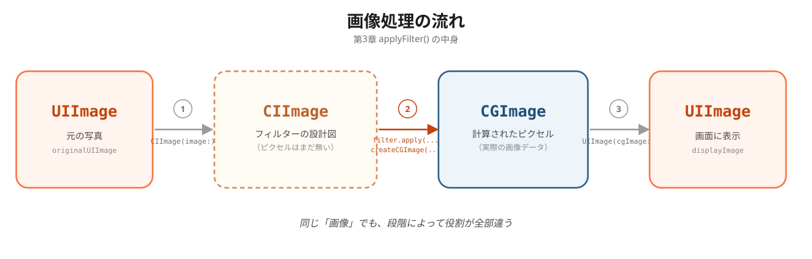

# 第3章：カメラの利用

> 執筆者：ソラナ
> 最終更新：2026-07-29

## この章で学ぶこと

写真を「選ぶ・撮る」→「加工する」→「見せる・保存する」までの流れと、SwiftUIとUIKitをつなぐ方法を学んだ章だった。

## 模範コードの全体像
```swift

// ============================================
// 第3章（応用）：写真にフィルターをかけて保存するアプリ
// ============================================
// 選択した写真にCoreImageフィルターを適用し、
// フォトライブラリに保存する機能を追加します。
//
// 【注意】Info.plist に以下のキーを追加してください：
//   - NSPhotoLibraryAddUsageDescription
//     値: "加工した写真を保存するためにフォトライブラリを使用します"
// ============================================

import SwiftUI
import PhotosUI
import CoreImage
import CoreImage.CIFilterBuiltins

// MARK: - フィルター定義

enum PhotoFilter: String, CaseIterable, Identifiable {
    case original = "オリジナル"
    case sepia = "セピア"
    case mono = "モノクロ"
    case chrome = "クローム"
    case fade = "フェード"
    case bloom = "ブルーム"

    var id: String { rawValue }

    func apply(to inputImage: CIImage, context: CIContext) -> CIImage? {
        switch self {
        case .original:
            return inputImage
        case .sepia:
            let filter = CIFilter.sepiaTone()
            filter.inputImage = inputImage
            filter.intensity = 0.8
            return filter.outputImage
        case .mono:
            let filter = CIFilter.photoEffectMono()
            filter.inputImage = inputImage
            return filter.outputImage
        case .chrome:
            let filter = CIFilter.photoEffectChrome()
            filter.inputImage = inputImage
            return filter.outputImage
        case .fade:
            let filter = CIFilter.photoEffectFade()
            filter.inputImage = inputImage
            return filter.outputImage
        case .bloom:
            let filter = CIFilter.bloom()
            filter.inputImage = inputImage
            filter.radius = 10
            filter.intensity = 0.8
            return filter.outputImage
        }
    }
}

// MARK: - メインビュー

struct ContentView: View {
    @State private var selectedItem: PhotosPickerItem?
    @State private var originalUIImage: UIImage?
    @State private var displayImage: Image?
    @State private var currentFilter: PhotoFilter = .original
    @State private var isSaving = false
    @State private var showSaveAlert = false
    @State private var saveMessage = ""
    @State private var isShowingCamera = false
    @State private var capturedUIImage: UIImage?

    private let context = CIContext()

    var body: some View {
        NavigationStack {
            VStack(spacing: 16) {
                // 画像表示
                if let image = displayImage {
                    image
                        .resizable()
                        .aspectRatio(contentMode: .fit)
                        .frame(maxHeight: 350)
                        .clipShape(RoundedRectangle(cornerRadius: 12))
                        .padding(.horizontal)
                } else {
                    placeholderView
                }

                // フィルター選択
                if originalUIImage != nil {
                    filterSelector
                }

                // ボタン群
                HStack(spacing: 16) {
                    PhotosPicker(selection: $selectedItem, matching: .images) {
                        Label("写真を選ぶ", systemImage: "photo")
                    }
                    .buttonStyle(.bordered)
                    Button {
                        isShowingCamera = true
                    } label: {
                        Label("カメラ", systemImage: "camera")
                    }
                    .buttonStyle(.bordered)

                    if displayImage != nil {
                        Button {
                            saveFilteredImage()
                        } label: {
                            Label("保存", systemImage: "square.and.arrow.down")
                        }
                        .buttonStyle(.borderedProminent)
                        .disabled(isSaving)
                    }
                }
                .padding()

                Spacer()
            }
            .navigationTitle("フォトフィルター")
            .onChange(of: selectedItem) { _, newItem in
                Task { await loadOriginalImage(from: newItem) }
            }
            .onChange(of: currentFilter) { _, _ in
                applyFilter()
            }
            .alert("保存結果", isPresented: $showSaveAlert) {
                Button("OK") {}
            } message: {
                Text(saveMessage)
            }
            .fullScreenCover(isPresented: $isShowingCamera) {
                CameraView(capturedImage: $capturedUIImage)
            }
            .onChange(of: capturedUIImage) { _, newImage in
                if let uiImage = newImage {
                    originalUIImage = uiImage
                    currentFilter = .original
                    displayImage = Image(uiImage: uiImage)
                }
            }
        }
    }
    
    struct CameraView: UIViewControllerRepresentable {
        @Binding var capturedImage: UIImage?
        @Environment(\.dismiss) private var dismiss

        func makeUIViewController(context: Context) -> UIImagePickerController {
            let picker = UIImagePickerController()
            picker.sourceType = .camera
            picker.delegate = context.coordinator
            return picker
        }

        func updateUIViewController(_ uiViewController: UIImagePickerController, context: Context) {}

        func makeCoordinator() -> Coordinator {
            Coordinator(self)
        }

        class Coordinator: NSObject, UIImagePickerControllerDelegate, UINavigationControllerDelegate {
            let parent: CameraView

            init(_ parent: CameraView) {
                self.parent = parent
            }

            func imagePickerController(
                _ picker: UIImagePickerController,
                didFinishPickingMediaWithInfo info: [UIImagePickerController.InfoKey: Any]
            ) {
                if let image = info[.originalImage] as? UIImage {
                    parent.capturedImage = image
                }
                parent.dismiss()
            }

            func imagePickerControllerDidCancel(_ picker: UIImagePickerController) {
                parent.dismiss()
            }
        }
    }

    // MARK: - プレースホルダー

    private var placeholderView: some View {
        RoundedRectangle(cornerRadius: 12)
            .fill(.gray.opacity(0.1))
            .frame(height: 300)
            .overlay {
                VStack(spacing: 8) {
                    Image(systemName: "camera.filters")
                        .font(.system(size: 48))
                        .foregroundStyle(.gray)
                    Text("写真を選んでフィルターを試そう")
                        .font(.caption)
                        .foregroundStyle(.secondary)
                }
            }
            .padding(.horizontal)
    }

    // MARK: - フィルター選択UI

    private var filterSelector: some View {
        ScrollView(.horizontal, showsIndicators: false) {
            HStack(spacing: 12) {
                ForEach(PhotoFilter.allCases) { filter in
                    VStack(spacing: 4) {
                        // フィルタープレビュー（サムネイル）
                        if let thumbnail = createThumbnail(filter: filter) {
                            Image(uiImage: thumbnail)
                                .resizable()
                                .aspectRatio(contentMode: .fill)
                                .frame(width: 60, height: 60)
                                .clipShape(RoundedRectangle(cornerRadius: 8))
                                .overlay(
                                    RoundedRectangle(cornerRadius: 8)
                                        .stroke(
                                            currentFilter == filter ? Color.blue : Color.clear,
                                            lineWidth: 3
                                        )
                                )
                        }

                        Text(filter.rawValue)
                            .font(.caption2)
                            .foregroundStyle(
                                currentFilter == filter ? .blue : .secondary
                            )
                    }
                    .onTapGesture {
                        currentFilter = filter
                    }
                }
            }
            .padding(.horizontal)
        }
    }

    // MARK: - 画像処理

    func loadOriginalImage(from item: PhotosPickerItem?) async {
        guard let item = item else { return }

        do {
            if let data = try await item.loadTransferable(type: Data.self),
               let uiImage = UIImage(data: data) {
                originalUIImage = uiImage
                currentFilter = .original
                displayImage = Image(uiImage: uiImage)
            }
        } catch {
            print("画像読み込みエラー: \(error)")
        }
    }
> [!NOTE]

    func applyFilter() {
        guard let uiImage = originalUIImage,
              let ciImage = CIImage(image: uiImage) else { return }

        guard let outputImage = currentFilter.apply(to: ciImage, context: context) else { return }

        if let cgImage = context.createCGImage(outputImage, from: ciImage.extent) {
            displayImage = Image(uiImage: UIImage(cgImage: cgImage))
        }
    }

    func createThumbnail(filter: PhotoFilter) -> UIImage? {
        guard let uiImage = originalUIImage,
              let ciImage = CIImage(image: uiImage) else { return nil }

        guard let output = filter.apply(to: ciImage, context: context) else { return nil }

        if let cgImage = context.createCGImage(output, from: ciImage.extent) {
            return UIImage(cgImage: cgImage)
        }
        return nil
    }

    func saveFilteredImage() {
        guard let uiImage = originalUIImage,
              let ciImage = CIImage(image: uiImage),
              let output = currentFilter.apply(to: ciImage, context: context),
              let cgImage = context.createCGImage(output, from: ciImage.extent) else { return }

        let finalImage = UIImage(cgImage: cgImage)
        UIImageWriteToSavedPhotosAlbum(finalImage, nil, nil, nil)

        saveMessage = "写真を保存しました"
        showSaveAlert = true
    }
}

#Preview {
    ContentView()
}


```

**このアプリは何をするものか：**

このアプリは、フォトライブラリから写真を選択したり、カメラで写真を撮影したりして、その写真にフィルターをかけるアプリです。
選んだ写真には、セピア、モノクロ、クローム、フェード、ブルームなどのフィルターを適用できます。また、加工した写真をフォトライブラリに保存することもできます。

## コードの詳細解説

### PhotosPickerによる写真選択

```swift
@State private var selectedItem: PhotosPickerItem?

PhotosPicker(selection: $selectedItem, matching: .images) {
    Label("写真を選ぶ", systemImage: "photo")
}
```

**何をしているか：**
フォトライブラリから画像を選択するためのボタンを表示しています。選ばれた写真の情報は selectedItem に入ります。
**なぜこう書くのか：**
SwiftUIで写真を選ぶための標準的なAPIなので、UIKitを使わずに簡単に写真選択機能を作れます。
**もしこう書かなかったら：**
写真を選ぶ入口がなくなるため、アプリで画像を読み込むことができません。

---

### 画像の非同期読み込み

```swift
.onChange(of: selectedItem) { _, newItem in
    Task { await loadOriginalImage(from: newItem) }
}

func loadOriginalImage(from item: PhotosPickerItem?) async {
    guard let item = item else { return }

    do {
        if let data = try await item.loadTransferable(type: Data.self),
           let uiImage = UIImage(data: data) {
            originalUIImage = uiImage
            currentFilter = .original
            displayImage = Image(uiImage: uiImage)
        }
    } catch {
        print("画像読み込みエラー: \(error)")
    }
}

```

**何をしているか：**
写真が選ばれたタイミングで、画像データを非同期で読み込み、画面表示用の画像に変換しています。

**なぜこう書くのか：**
写真の読み込みには時間がかかる場合があるため、async/await と Task を使って画面が止まらないようにしています。

**もしこう書かなかったら：**
写真を選んでも画像が画面に表示されません。また、同期処理で書くと画面が重くなる可能性があります。

---

### UIViewControllerRepresentableによるカメラ連携

struct CameraView: UIViewControllerRepresentable {
    @Binding var capturedImage: UIImage?
    @Environment(\.dismiss) private var dismiss

    func makeUIViewController(context: Context) -> UIImagePickerController {
        let picker = UIImagePickerController()
        picker.sourceType = .camera
        picker.delegate = context.coordinator
        return picker
    }

    func updateUIViewController(_ uiViewController: UIImagePickerController, context: Context) {}
}
```

**何をしているか：**
SwiftUIの画面から、UIKitの UIImagePickerController を使ってカメラを起動しています。

**なぜこう書くのか：**
カメラ機能はSwiftUIだけでは直接作りにくいため、UIViewControllerRepresentable を使ってUIKitの機能をSwiftUIで使えるようにしています。

**もしこう書かなかったら：**
SwiftUIの画面からカメラを開くことができません。

---

### Coordinatorパターン

```swift
func makeCoordinator() -> Coordinator {
    Coordinator(self)
}

class Coordinator: NSObject, UIImagePickerControllerDelegate, UINavigationControllerDelegate {
    let parent: CameraView

    init(_ parent: CameraView) {
        self.parent = parent
    }

    func imagePickerController(
        _ picker: UIImagePickerController,
        didFinishPickingMediaWithInfo info: [UIImagePickerController.InfoKey: Any]
    ) {
        if let image = info[.originalImage] as? UIImage {
            parent.capturedImage = image
        }
        parent.dismiss()
    }

    func imagePickerControllerDidCancel(_ picker: UIImagePickerController) {
        parent.dismiss()
    }
}
```

**何をしているか：**
カメラで撮影した写真を受け取り、capturedImage に保存しています。また、撮影後やキャンセル後にカメラ画面を閉じています。
**なぜこう書くのか：**
UIImagePickerController は撮影完了やキャンセルの結果を delegate で受け取る仕組みなので、Coordinator がSwiftUIとUIKitの橋渡しをしています。
**もしこう書かなかったら：**
撮影した写真をSwiftUI側に渡せません。また、撮影後にカメラ画面を閉じる処理もできません。
---

## 新しく学んだSwiftの文法・API

| 項目 | 説明 | 使用例 |
|------|------|--------|
| 例：`PhotosPicker` | フォトライブラリから画像を選択するコンポーネント | `PhotosPicker(selection: $selectedItem, matching: .images)` |
| 例：`UIImagePickerController` | カメラまたはフォトライブラリにアクセスするUIKitコンポーネント | `picker.sourceType = .camera` |
|async/await | 時間がかかる処理を非同期で実行する書き方| try await item.loadTransferable(type: Data.self)|
| UIImagePickerController|カメラを起動して写真を撮影するUIKitの機能| picker.sourceType = .camera|
|UIImageWriteToSavedPhotosAlbum|画像をフォトライブラリに保存する関数 | UIImageWriteToSavedPhotosAlbum(finalImage, nil, nil, nil)|

## 自分の実験メモ

**実験1：**
- やったこと：最初はフォトライブラリから写真を選ぶ機能だけを確認しました。
- 結果：写真を選ぶと、画面に選択した写真が表示されました。
- わかったこと：PhotosPicker と onChange を使うことで、写真が選ばれたタイミングで画像を読み込めることが分かりました。

**実験2：**
- やったこと：フォトライブラリの写真選択機能に加えて、カメラで撮影する機能を追加しました。
- 結果：カメラで撮影した写真も画面に表示でき、フィルターをかけることができました。
- わかったこと：SwiftUIでカメラを使う場合は、UIViewControllerRepresentable を使ってUIKitの機能を連携する必要があると分かりました。

## AIに聞いて特に理解が深まった質問 TOP3

1. **質問：**PhotosPickerItem から画像を表示するには、なぜ loadTransferable(type: Data.self) を使うのか。
   **得られた理解：**PhotosPickerItem は画像そのものではなく、選択された写真の情報を持つ型なので、実際の画像データを取り出すために loadTransferable を使う必要があると分かりました。

2. **質問：**UIImage、CIImage、CGImage はそれぞれ何が違うのか。
   **得られた理解：**UIImage は画面表示や保存に使いやすい画像型で、CIImage はCoreImageでフィルター処理をするための画像型、CGImage は処理後の画像を実際に生成するために使う画像型だと分かりました。

3. **質問：**なぜカメラ機能では Coordinator が必要なのか。
   **得られた理解：**UIImagePickerController は撮影完了やキャンセルの結果をDelegateで返すため、その結果を受け取ってSwiftUI側へ渡す役割として Coordinator が必要だと分かりました。

## この章のまとめ

この章では、SwiftUIで写真を選択する方法、カメラで撮影する方法、CoreImageを使って写真にフィルターをかける方法、加工した写真を保存する方法を学びました。
特に、SwiftUIだけでなくUIKitの機能を使うために、UIViewControllerRepresentable と Coordinator が必要になることを理解しました。
また、複数のサンプルコードをそのまま貼るのではなく、必要な機能を整理して1つの ContentView にまとめることが大切だと分かりました。


## メモ：第3章 カメラの利用

**テーマ：画像の種類のなぜ（CIImage / CGImage / UIImage）**

「カメラの利用」の中から、CIImage・CGImage・UIImageの違いについて話します。
最初、この3つを見たとき、「全部『画像』なのに、なぜ3つもあるのか」と思いました。AIに聞いて、一番よく分かった部分です。

---

### 本体

```swift
func applyFilter() {
    guard let uiImage = originalUIImage,
          let ciImage = CIImage(image: uiImage) else { return }

    guard let outputImage = currentFilter.apply(to: ciImage, context: context) else { return }

    if let cgImage = context.createCGImage(outputImage, from: ciImage.extent) {
        displayImage = Image(uiImage: UIImage(cgImage: cgImage))
    }
}
```

**内容：**
まず、AIに聞く前の自分の理解

最初にこのコードを見たとき、正直、UIImageもCIImageもCGImageも「全部同じような画像でしょう？」と思っていました。名前が違うだけで、中身は似たようなものだろうと。だから、なぜわざわざ3回も型を変えているのかが分かりませんでした。

AIに聞いて分かった3つの違い

① UIImage → CIImage に変える

swift
let ciImage = CIImage(image: uiImage)

UIImageは、画面に出す・保存するための画像です。一番よく使う、普通の画像。

でもフィルターをかけるには、UIImageのままでは使えません。CIImageに変える必要があります。

ここでAIの説明が面白かったのは、「CIImageは画像ではなく、これから何をするかのメモ」という言い方でした。CIImageを作った時点では、まだ中身（ピクセル）はできていません。フィルターの内容だけ持っています。

料理に例えると、CIImageは「レシピ」です。材料を書いてあるけど、まだ料理は始まっていない状態です。

② フィルターをかける

swift
let outputImage = currentFilter.apply(to: ciImage, context: context)

ここでフィルターをかけます。でも、この結果もまだCIImageです。つまり、「レシピに手順を追加した」だけで、まだ料理はしていません。

なぜすぐに計算しないのか？AIの説明では、フィルターを何回もかけるとき、毎回計算すると時間がかかるからです。最後に1回だけ計算するほうが速い。これを「遅延評価」と言うそうです。

③ CIContext が計算して CGImage になる

swift
let cgImage = context.createCGImage(outputImage, from: ciImage.extent)

ここで初めて、CIContextが「レシピ」を見て、実際に料理を作ります。結果がCGImage、つまり本当のピクセルデータです。

この行がなかったら、フィルターは設計図のままで、画面には何も出ません。

④ CGImage → UIImage に戻して表示

swift
displayImage = Image(uiImage: UIImage(cgImage: cgImage))

最後に、できた料理（CGImage）をお皿（UIImage）に盛り付けて、画面に表示します。

 

1. UIImageは、画面に出す・保存するための画像
　→ 一番よく使う、普通の画像です。

2. CIImageは、「画像」ではなく「これから何をするかのメモ」
　→ CIImageを作った時点では、まだ中身（ピクセル）はできていません。フィルターの内容だけ持っています。

3. CGImageは、CIContextが実際に計算して作った画像
　→ `context.createCGImage()`を呼ぶと、初めて本当の画像データができます。

4. なぜ3つも必要なのか
　→ 表示するとき（UIImage）と、フィルターをかけるとき（CIImage）で、得意なことが違うからです。フィルターをかけるときは、メモ（CIImage）→計算（CGImage）→表示（UIImage）の順番で進みます。

同じ「画像」という言葉でも、3つは全然違う役目を持っていた、という発見です。

---

### 学んだこと

聞く前は、CIImageもUIImageも同じようなものだと思っていました。本当は「まだ中身がないメモ」と「もうできた画像」という違いがあり、コードを見ただけでは気づけませんでした。4月の自分に言うなら、「名前が違うのには、ちゃんと理由がある」と伝えたいです。
---


